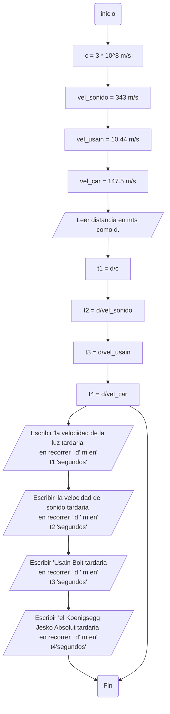

# Solucion Taller 1 PDC
### Integrantes: 
| Nombre | ID |
|---|---|
| Alejandro Bello | 1013037759 |
| Malcolm Carrillo | 789012 |
| Rafael Chirivi | 345678 |

<details><summary>Preparense para ver el grandioso logo: </summary><p>
<div align='center'>
<figure> </br>
<figcaption><b> "somos programadores, no diseñadores" </b></figcaption></figure>
</div>
</p></details><br>

## Acá se muestran los resultados de los quizes de python (numeral 1):
### Alejandro:
[](https://postimg.cc/8jyRp8ZL)
### Malcolm: 

### Rafael: 

## Los ejercicios impares (3, 5, 7, 9) están en el archivo taller_1.ipynb al inicio del repo
## Los ejercicios pares (2, 4, 6, 8, 10) estan a continuación:
#### Ejercicio 2
```python
# 2. Realice un programa que lea tres números reales y determine cuál es el mayor.

num1 : float
num2 : float
num3 : float
num1 = float(input("Por favor ingrese el primer numero: "))
num2 = float(input("Por favor ingrese el segundo numero: "))
num3 = float(input("Por favor ingrese el tercer numero: "))
if num1 > num2 and num1 > num3:
    print(num1, ", siendo el primer numero ingresado, es el mayor entre los demas")
elif num2 > num1 and num2 > num3:
    print(num2, ", siendo el segundo numero ingresado, es el mayor entre los demas")
elif num3 > num1 and num3 > num2:
    print(num3, ", siendo el tercer numero ingresado, es el mayor entre los demas")
else:
    print("Hay 2 o mas numeros mayores o iguales que el resto")

```
#### Ejercicio 4
```python
# 4. Realice un programa que lea dos números reales y determine si el primero es múltiplo del segundo.

um1 : float
num2 : float
num1 = float(input("Por favor ingrese el primer numero: "))
num2 = float(input("Por favor ingrese el segundo numero: "))
multiplo : float
multiplo = num2%num1
if multiplo == 0:
    print("El primer numero ingresado " ,num1, " es multiplo del segundo numero ingresado " ,num2)
else:
    print("El primer numero ingresado " ,num1, " no es multiplo del segundo numero ingresado " ,num2)
```
#### Ejercicio 6
```python
# 6. Escriba un programa que solicite al usuario una letra y determine si es una vocal o una consonante.

letra : str
letra = str(input("Por favor ingrese una letra para ser evaluada"))
if len(letra) ==1:
    if ord(letra) >= 65 and ord(letra) <= 90:
        if ord(letra) == 65 or ord(letra) == 69 or ord(letra) == 73 or ord(letra) == 79 or ord(letra) == 85:
            print("La letra ingresada corresponde a una vocal mayuscula")
        else:
            print("La letra ingresada corresponde a una consonante mayuscula")
    elif ord(letra) >= 97 and ord(letra) <= 122: 
        if ord(letra) == 97 or ord(letra) == 101 or ord(letra) == 105 or ord(letra) == 111 or ord(letra) == 117:
            print("La letra ingresada corresponde a una vocal minuscula")
        else:
            print("La letra ingresada corresponde a una consonante minuscula")
else:
    print("La cadena ingresada no es una letra, o es mas de una")
```
#### Ejercicio 8
```python
# Escriba un programa al que se le ingrese la frecuencia de una onda en hz y como salida arroje en que parte del espectro electromagnético se encuentra.

def espectro(frecuencia: float):
  if frecuencia < 3:
    return "Ondas de radio"
  elif frecuencia < 300e9:
    return "Microondas"
  elif frecuencia < 400e12:
    return "Infrarrojo"
  elif frecuencia < 750e12:
    return "Luz visible"
  elif frecuencia < 30e15:
    return "Ultravioleta"
  elif frecuencia < 30e18:
    return "Rayos X"
  else:
    return "Rayos gamma"

frecuencia = float(input("Ingrese la frecuencia (Hz) de la onda que desea consultar:  ")) 

f_onda = espectro(frecuencia)
print("la frecuencia", frecuencia, "pertence al espectro electromagnetico de:", f_onda)
```
#### Ejercicio 10
```python
# Escriba un programa que dada una distancia calcule:
    # - El tiempo que le tomaría a la luz recorrer la distancia.
    # - El tiempo que le tomaría al sonido (en el aire) recorrer la distancia.
    # - El tiempo que le tomaría al vehiculo comercial más veloz recorrer la distancia.
    # - El tiempo que le tomaría a Bolt recorrer la distancia.

# Declarar constantes
VEL_LUZ: float = 3e+8
VEL_SONIDO: float = 343
VEL_BOLT: float = 10.44
VEL_CHIRON: float = 147.5

if __name__ == "__main__":

    distancia= float(input("ingrese una distancia en metros:   "))  #Se inserta el valor de la distancia (en metros)

    # devuelve el tiempo que cada velocidad tardaría en recorrer esa distancia
    luz = print("a la luz le tomaría:", distancia/VEL_LUZ, "s")
    sonido =print("al sonido le tomaria:", distancia/VEL_SONIDO, "s")
    bolt= print("a Usain Bolt le tomaría:", distancia/VEL_BOLT, "s" )
    auto= print("al Koenigsegg Jesko Absolut le tomaría:", distancia/VEL_CHIRON, "s")
```
#### Además, por el digito 0 de la TI de Rafa, adjuntamos el diagrama de flujo de este ejercicio:

# Bonus
<details><summary>SORPRESAS</summary><p>
<div align='center'>
  <p>¡El primer video de los fenomenoides!</p>
  <p> <a href="https://www.youtube.com/watch?v=EhBrKKHbNR0&t=64s">Enlace al video de YouTube</a>
  </p>
</div>
</p></details><br>
